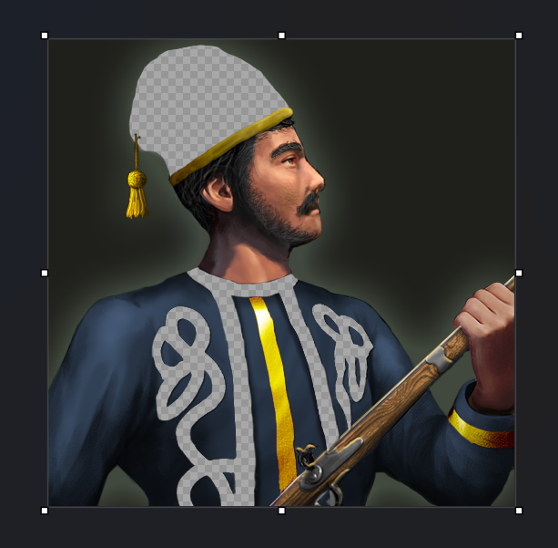
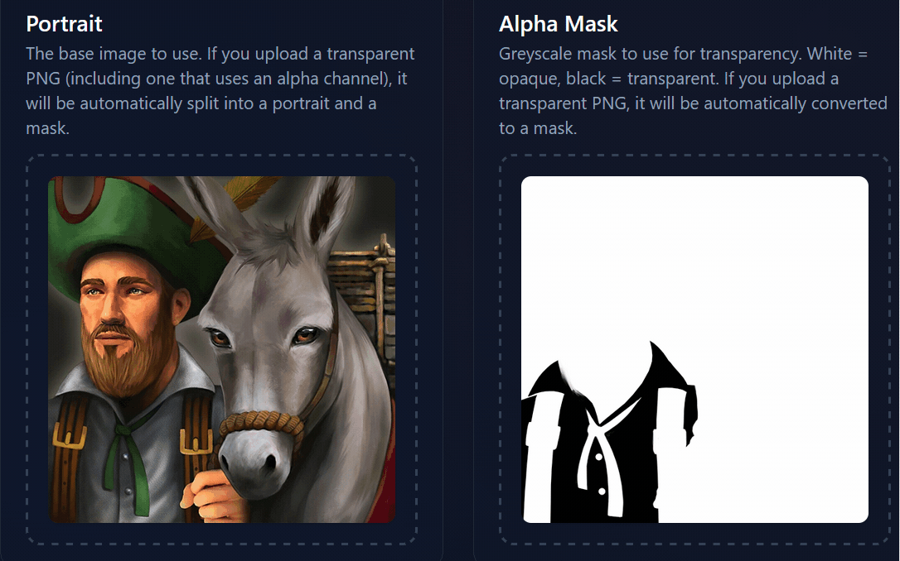
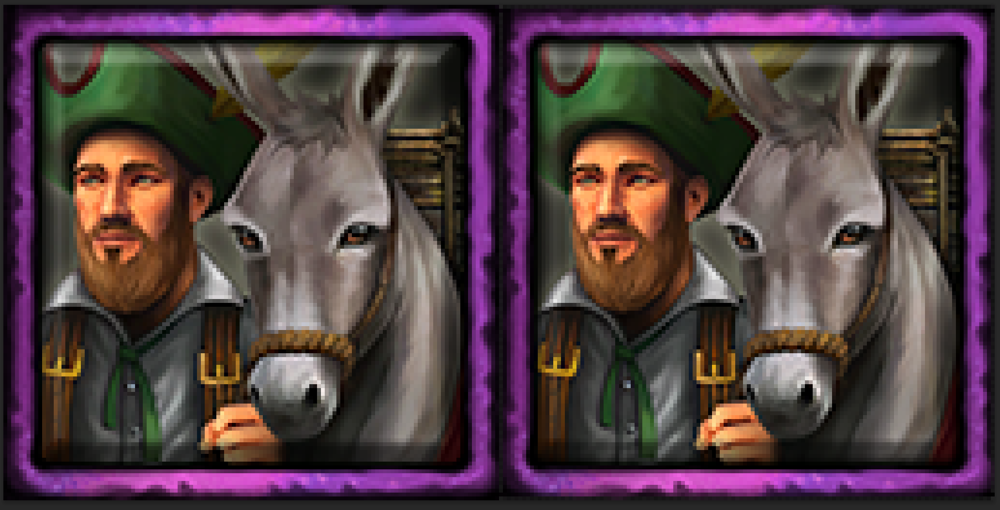

# Age of Empires III DE Unit Icon Maker
A client-side web application for generating icons for *Age of Empires III*. Units, techs, and home city cards require various icons, which are distinguished by the colour of their frames; the game doesn't do any of this for us, so **you can use this tool to create icons with any frames you want**.

In recent times in the Definitive Edition, bunches of home city cards now use **mixed-colour frames**, where the frame is bisected by its diagonal and consists of two colours. **This tool can create icons with mixed-colour frames as well**.

## Alphas and Transparency
The main reason for this tool's existence, however, is transparency. Unit portraits and icons use transparency with _alpha masks_.

Read the following (collapsed) guide to understand what that means. If you know what an _alpha mask_ is, you may proceed onwards (and probably didn't need these instructions to begin with).

<b>Guide: Alpha Masks & Transparency</b>

Anyone can extract an icon frame from the in-game files and put it in a photoshop file (and then never share it in a public location 😒), so why bother using this tool? Because of **transparency**.

Icons used in game are usually PNGs, which makes it very easy for us to work with them. Except for one caveat: transparency. The PNGs used in game do not use transparency normally. If you extract an unit portrait from the game (that's `Game/UI/UIResources1.bar` when using the [Resource Manager](https://github.com/eBaeza/Resource-Manager)), you'll likely notice that it appears to be semi-transparent. You'll also likely notice that unit portraits and icons in the game change depending on your player colour.

This zouave portrait, for example, that I have extracted from the game and opened in Paint (same result in Photoshop) appears to be transparent in the places where the player colour should be applied:

So you might think you need to make a portion of your image transparent to have player colours show up, right? **WRONG.**

The PNGs used for unit portraits actually use an _alpha mask_ to define their transparency. This means that ALL colours in the image are defined in all pixels, and there's an additional _channel_ that contains information about transparency. If you've done modding before, the concept may be familiar. Regardless, the point is that Paint (and Photoshop, and likely other image editors) do not display this information properly. In Photoshop, for example, you need an extension ([SuperPNG](https://fnord.com/)) in order to be able to open a transparent PNG without destroying the underlying colours of the image.

(This phenomenon is called _premultiplication_: the colours of the image, in the R/G/B channels, are multiplied by the opacity values contained in the fourth "alpha" channel. This is done for valid reasons, but just happens to be something we don't want at this time.)

Fortunately for us, all we need is just an easy way to make our own images (and, as a side effect, an easy way to split game icons for those of us who don't have editors that give us full liberty over the alpha channel).

## How to Use
Usage should be quite self-explanatory, but here are instructions just in case.

1. Drop the image you want to use on the _"Portrait"_ slot, on top of the settler wagon example. You may also click on the slot to open a file selection dialog.
1. (Optional) Drop a mask on the _"Alpha Mask"_ slot. This should contain the transparency you want to use for your portrait and unit icon.
    - Alternatively, if you don't wish to use transparency at all, you can hover over the Alpha Mask slot and click the small "Clear" button to remove the mask completely.
1. (Optional) Set the "unit name" textbox. This is the base name that you icon files will use when they're downloaded. If left blank, will be automatically derived from the images you add.
1. (Optional) Use the _Quick Export_ buttons to download either the portrait, or the mask, or the portrait with mask applied in the game-ready format.
1. Tick any number of icons with frames that you wish to generate. All single-colour-frame icons are enabled by default, and no mixed-frame icons are enabled by default.
1. Click any of the download buttons to download output.

<b>Example: Splitting Alpha-Masked PNGs</b>

Useful for icons extracted from the game, like the zouave in this example, or if you've already prepared a PNG that contains colour information overlaid with transparency. Will be split into a portrait and an alpha mask, which you can later download using the Quick Export buttons.

Observe that our zouave, which I've extracted using the Resource Manager, is accurately split into colours and a mask: note that his fez is not a flat slab of colour, as your image viewer would incorrectly depict if you were to open the PNG file.

<b>Example: Mask Only</b>

If you drop a transparent PNG into the Alpha Mask slot, a mask will be extracted from its transparency. (If you drop a black and white image, it will be used as a mask.) The Portrait will never be overwritten when you add an image into the Alpha Mask slot.

<b>Example: Transparent Portrait</b>

If you add a normal transparent image in the Portrait slot, for example if we're making a new War Elephant icon, transparency will be split from it but you'll notice that the image probably lacks colour in the transparent areas. Observe that the background of the elephant ends up being black:

(Elephant clip art sourced from [here](https://www.vecteezy.com/png/19045782-elephant-png-graphic-clipart-design))

Here's how icons generated using this image would look:

## Running Locally
Although this is a single HTML page, you should not attempt to run the local file. Use the [Github Pages site for this repo](https://lumosx.github.io/AoE3-Icon-Maker/) instead.

If you really want to run the tool locally:

1. Clone the repo.
1. Start a web server in the folder: `docker compose up` or `python -m http.server` (or whatever other way you want, depending on what you have installed)
1. Go to [`http://localhost:8000/`](http://localhost:8000/) (not HTTPS).

## Details
The frames have been extracted from icons already present in the game. The overlay effect, as well as the passive ability frame have been constructed from scratch. I spent a few hours trying to get the bevel and shadows to match up as closely as possible to the in-game ones, and far too long trying to paint a somewhat pleasant-looking result for the passive. Yeah, it's not a drop shadow effect, it's painted by hand from scratch.

<b>Icon Comparison</b>

One of the zoomed-in icons below was generated by the tool, while the other one is extracted straight from the game. Can you tell which is which?

### Implementation
The app itself started as a vibe coding project using [LMArena](https://lmarena.ai/), as a duel between GPT 5.something and Claude 4.5 Opus. First time vibe coding an actual application (so far I've just been using Copilot at work), so I was surprised by how much effort it saved me even though I had to slap the models on the wrists a dozen times, and had to perform a bunch of refactoring and bugfixing by hand. Imagine having to remember all the tailwind classes by yourself... no thanks pal.

The project could probably use more refactoring. Not like anyone cares, anyway.

## Licensing
* Code licensed under the MIT license.
* ⚠️ The single-colour frames, as well as the settler wagon portrait used as the example image, are modified versions of assets extracted directly from the game. Thus, those assets are property of World's Edge, Microsoft, and whoever else, and follow whatever licensing applies for Age of Empires III mods and as per the game's EULA. Icons created using this tool are probably considered derivative works and I wouldn't use them for anything else other than making AoE3 mods.
* _Attribution_ (if you use this tool, say so and post a link to it) would be appreciated.
